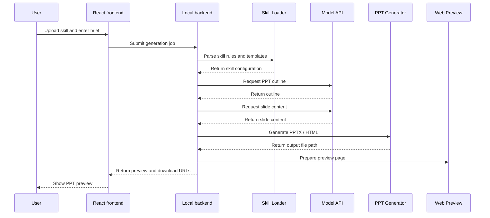
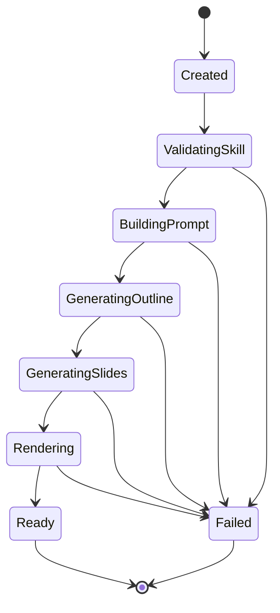

# Generation Sequence

```mermaid
sequenceDiagram
    participant User as User
    participant React as React frontend
    participant API as Local backend
    participant Skill as Skill Loader
    participant LLM as Model API
    participant PPT as PPT Generator
    participant Web as Web Preview

    User->>React: Upload skill and enter brief
    React->>API: Submit generation job
    API->>Skill: Parse skill rules and templates
    Skill-->>API: Return skill configuration
    API->>LLM: Request PPT outline
    LLM-->>API: Return outline
    API->>LLM: Request slide content
    LLM-->>API: Return slide content
    API->>PPT: Generate PPTX / HTML
    PPT-->>API: Return output file path
    API->>Web: Prepare preview page
    API-->>React: Return preview and download URLs
    React-->>User: Show PPT preview
```

## Initial Job States

```mermaid
stateDiagram-v2
    [*] --> Created
    Created --> ValidatingSkill
    ValidatingSkill --> BuildingPrompt
    BuildingPrompt --> GeneratingOutline
    GeneratingOutline --> GeneratingSlides
    GeneratingSlides --> Rendering
    Rendering --> Ready

    ValidatingSkill --> Failed
    BuildingPrompt --> Failed
    GeneratingOutline --> Failed
    GeneratingSlides --> Failed
    Rendering --> Failed

    Ready --> [*]
    Failed --> [*]
```

