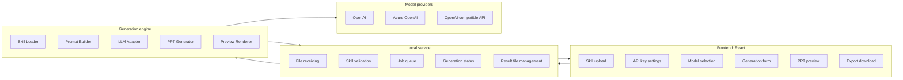

# Layered Architecture

## Responsibilities

- Frontend: simple workflow for upload, configuration, generation progress, preview, and download.
- Local service: API boundaries, validation, job orchestration, and local file management.
- Generation engine: skill loading, prompt assembly, model calls, deck generation, and preview rendering.
- Providers: model-specific API integration behind a stable internal interface.

