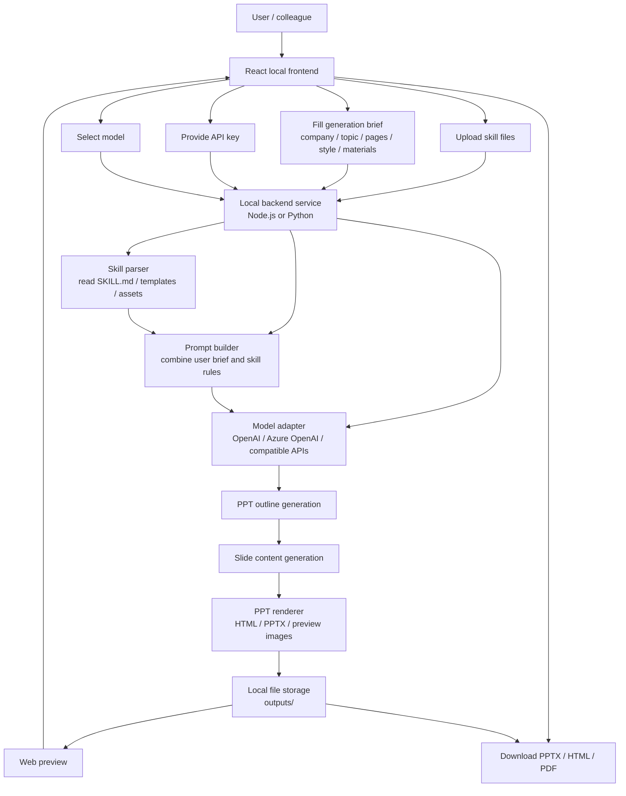

# System Overview

The app should let non-technical users upload a company PPT skill, provide an API key, select a model, describe the PPT they need, and preview or export the generated deck from a local web UI.

